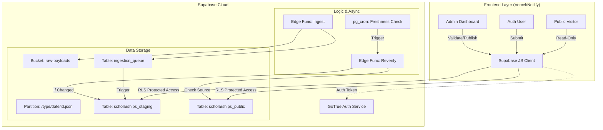

# Architecture Globale - API Builder Bourses (Supabase MVP Edition)

## Supabase Implementation Mapping

| Composant Abstrait | Implémentation Supabase (Free Tier) | Justification "Light" |
| :--- | :--- | :--- |
| **Frontend App** | **SPA (React/Vue)** hostée sur Vercel/Netlify | Hoster statique gratuit. Interagit directement avec Supabase via JS Client. |
| **Auth** | **Supabase Auth** (Email/Password + Providers) | Gestion complète des users. JWT contient le `sub` (user_id) pour les RLS. |
| **Ingestion Queue** | **Table SQL** `ingestion_queue` | File d'attente persistante simple dans Postgres. |
| **Zone Raw (Lake)** | **Supabase Storage** (Bucket `raw-payloads`) | Stockage fichier bon marché. Séparé par type de source. |
| **Zone Staged** | **Table SQL** `scholarships_staging` | Espace de travail pour validation Admin et retours de Freshness Check. |
| **Zone Final** | **Table SQL** `scholarships_public` | Vitrine publique. Contient les champs de fraîcheur (`last_verified_at`). |
| **Workers** | **Supabase Edge Functions** | Ingestion, Scraping, Revalidation annuelle. |
| **Scheduler** | **pg_cron** | Déclenchement des batches de revalidation. |

## Vision Conceptuelle : "Serverless DB-Centric + Frontend"

L'architecture ajoute une couche Frontend qui dialogue directement avec la DB pour les opérations CRUD (lecture publique, validation admin), sécurisée par RLS. Les Edge Functions gèrent "l'intelligence" en arrière-plan (ingestion, revalidation).

### Diagramme de Composants (Frontend + Backend)

## Description des Zones & Modèles de Données

### 1. Zone Raw (Storage)
*   **Contenu :** Payload JSON d'origine exacte.
*   **Typologie des Sources :**
    1.  `SCRAPING` : Résultat brut d'un script de scraping (HTML converti ou JSON).
    2.  `PUBLIC_API` : Réponse brute d'un `GET` sur une API tierce (ex: data.gouv).
    3.  `USER_SUBMISSION` : Payload `POST` envoyé par le formulaire Front.
*   **Organisation (Path Strategy) :**
    *   Pattern : `/{source_type}/{YYYY}/{MM}/{source_id}_{timestamp}.json`
    *   Exemple : `/scraping/2026/01/campus_france_123_1706600000.json`
    *   Exemple : `/user_submission/2026/01/auth_uid_456_1706600000.json`

### 2. Zone Staged (Admin Validation)
*   **Rôle :** Zone tampon pour les nouvelles soumissions ET les mises à jour de fraîcheur.
*   **Table :** `scholarships_staging`
    *   `id`: UUID (PK)
    *   `data`: JSONB (Données normalisées).
    *   `status`: ENUM (`PENDING`, `UNDER_REVIEW`, `APPROVED`, `REJECTED`).
    *   `source_type`: ENUM (`SCRAPING`, `PUBLIC_API`, `USER_SUBMISSION`).
    *   `origin_url`: TEXT (Pour Scraping/API - lien vers la source originale).
    *   `submitted_by`: UUID (Pour User Submission - lien `auth.users`).
    *   `freshness_check`: BOOLEAN (True si généré par le process de revalidation).

### 3. Zone Final (Public Exposure)
*   **Rôle :** Données exposées aux anonymes.
*   **Table :** `scholarships_public`
    *   `id`: UUID (PK)
    *   `title`, `amount`, `deadline`... (Colonnes typées).
    *   `published_at`: Timestamp.
    *   **Champs de Fraîcheur :**
        *   `last_verified_at`: Timestamp (Dernier check réussi).
        *   `next_verification_due`: Timestamp (Date du prochain check, ex: +1 an).
        *   `verification_status`: ENUM (`VERIFIED`, `NEEDS_REVIEW`, `OUTDATED`).
        *   `source_url`: TEXT (Critique pour la revalidation API/Scraping).

## Matrice Rôles & Sécurité (RLS)

| Rôle | Table: Final (Public) | Table: Staged (Validation) | Table: Raw/Queue |
| :--- | :--- | :--- | :--- |
| **Anonymous** | **SELECT** (Active only) | Interdit | Interdit |
| **User** | **SELECT** (Active only) | **INSERT** (Create), **SELECT** (Own) | Interdit (via Edge Func) |
| **Admin** | **SELECT** | **ALL** (Read/Write/Pub) | **SELECT** (Audit) |
| **Service** (Edge) | **ALL** (System) | **ALL** (System) | **ALL** (System) |

### Gestion des Rôles
Pour le MVP, le rôle est défini soit :
1.  Dans `auth.users.user_metadata` (`{ "role": "admin" }`).
2.  Dans une table `public.profiles` liée à l'ID auth.
Les Policies RLS vérifient ce claim pour autoriser les actions Admin.

## MVP Free-tier Constraints

*   **Frontend :** Hébergement statique externe (Vercel) pour ne pas consommer de ressources Supabase.
*   **Batch Revalidation :** Le CRON ne doit pas traiter 1000 bourses d'un coup (Timeout Edge Functions). Il doit traiter par petits lots (ex: 10 par 10) chaque nuit.