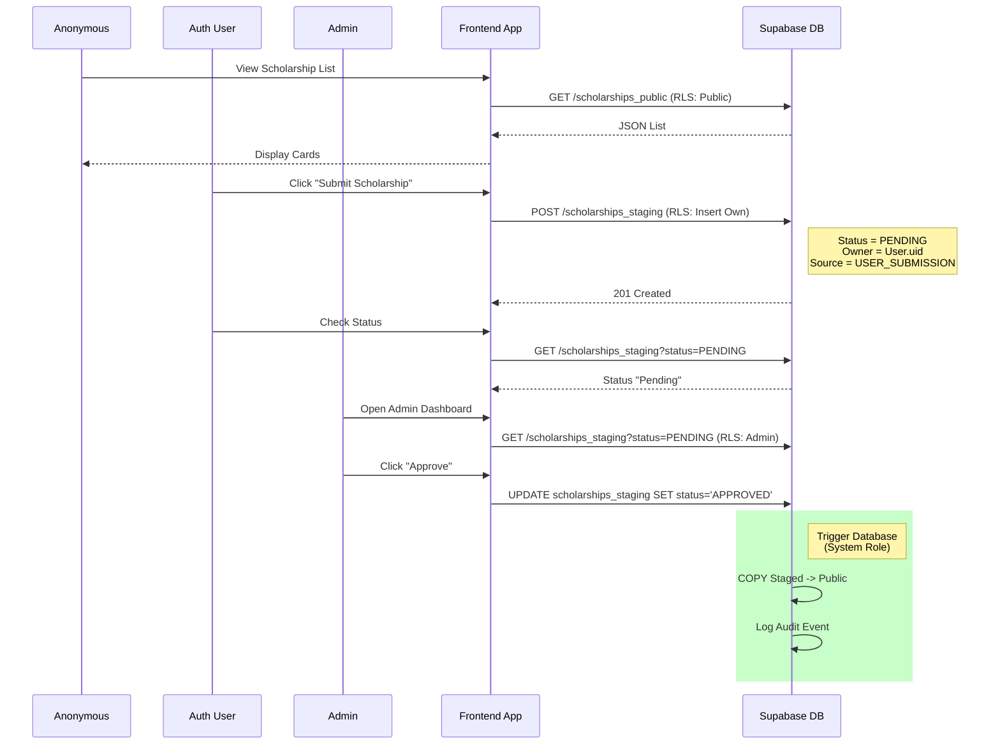
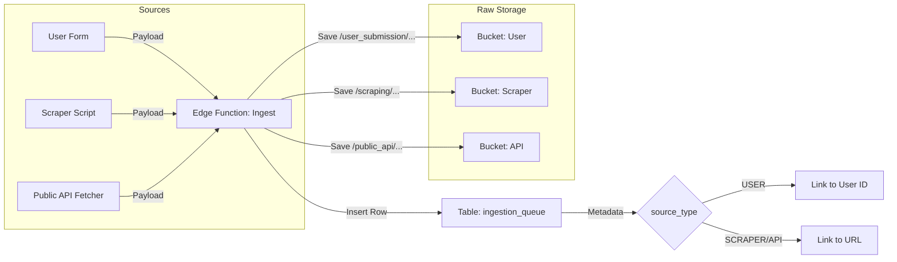
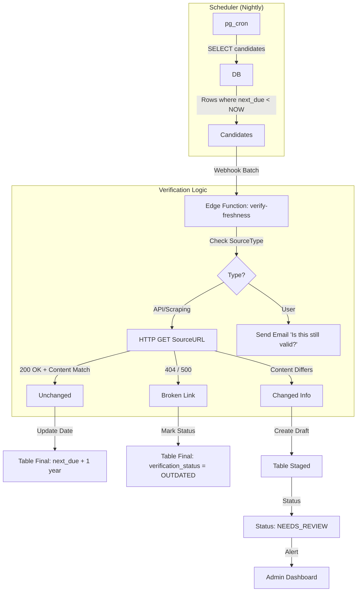

# Flux de Données et User Journeys (Supabase Edition)

## 1. User Journeys (Frontend)

Diagramme des interactions utilisateurs avec le système via l'application Front.

## 2. Flux d'Ingestion Multi-Sources

Détail de comment les 3 types de sources alimentent la file d'attente.

## 3. Flux de Revalidation Annuelle (Freshness)

Processus automatique pour garantir que les données ne périment pas.

## 4. Détail des Règles RLS (Row Level Security)

Les règles sont appliquées au niveau de la base de données, rendant l'API sûre par défaut.

### Table: `scholarships_public`
*   **Policy `public_view`**:
    *   `SELECT` using `(true)`
    *   Autorise tout le monde (même non connecté) à lire.
*   **Policy `system_write_only`**:
    *   `INSERT/UPDATE/DELETE` using `(false)`
    *   Personne ne peut écrire via l'API. Seuls les triggers internes (`security definer`) le peuvent.

### Table: `scholarships_staging` (Admin Validation)
*   **Policy `user_submit`**:
    *   `INSERT` with check `(auth.uid() = submitted_by)`
    *   `SELECT` using `(auth.uid() = submitted_by)`
    *   L'utilisateur peut créer et voir SES bourses.
*   **Policy `admin_manage`**:
    *   `ALL` using `(auth.jwt() ->> 'role' = 'admin')`
    *   L'admin peut tout voir et tout modifier.

### Table: `audit_logs`
*   **Policy `admin_view`**:
    *   `SELECT` using `(auth.jwt() ->> 'role' = 'admin')`
    *   Seuls les admins peuvent voir l'historique des actions.

## 5. Traçabilité et Logs

Chaque action critique (création, validation, publication) est enregistrée.

**Table `validation_events` (Audit) :**
*   `event_type`: (SUBMIT, APPROVE, REJECT, AUTO_REVALIDATE)
*   `scholarship_id`: UUID
*   `actor_id`: UUID (User ID, Admin ID, ou 'system' pour le cron)
*   `source_type`: (SCRAPING, USER, API)
*   `created_at`: NOW()

*Ce log est rempli automatiquement par des **Triggers Database** à chaque changement de statut dans `scholarships_staging`.*